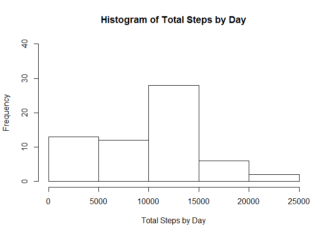
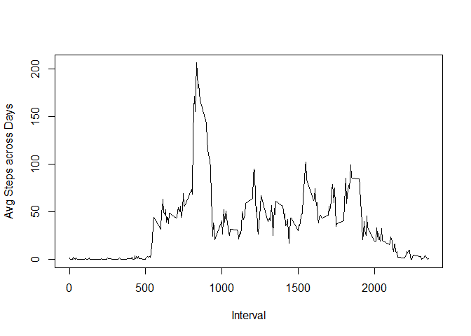
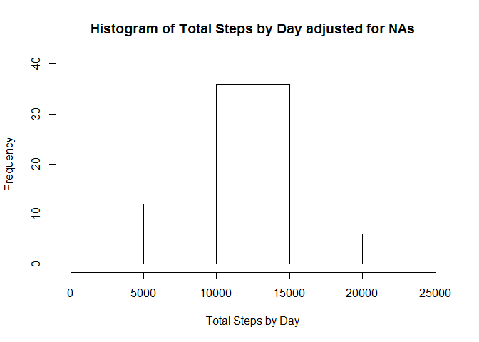
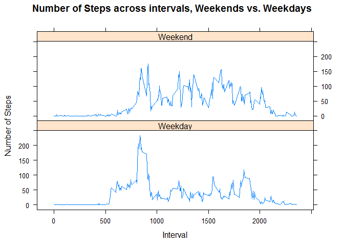

# Reproducible Research: Peer Assessment 1
Aaron Augustine  
Tuesday, June 09, 2015  
    
This document provides the results for Reproducible Research Assignment 1.  It will do this by answering a series of given questions using the R code below.


   

### Loading and preprocessing the data

Below is the code used to  

1. Load the data (i.e. `read.csv()`)


```r
#reference packages
library(downloader)
library("plyr")
library(lattice) 
```


```r
filename <-paste(getwd(),"/activity.zip",sep="")  #set file name to unzip
unzip (filename, exdir = getwd())                 #unzip file for analysis

### Loading and preprocessing the data
rawdata<-read.csv("./activity.csv",
                  header=TRUE,
                  sep=",",
                  colClasses=c("numeric","character","numeric"),
                  na.strings = "NA"
)                                                 #read in raw .csv file      
```

2. Process/transform the data into a format suitable for analysis (covert the date)


```r
rawdata$date <- as.Date(rawdata$date)           #convert charcater date to actual date format
```


### What is mean total number of steps taken per day?

For this part of the assignment, you can ignore the missing values in
the dataset.

1. Make a histogram of the total number of steps taken each day

```r
totalsteps<-ddply(rawdata,c("date"),
                  summarize,
                  totalsteps=sum(steps,
                                 na.rm=TRUE))     #calculate total number of steps by day

hist(totalsteps$totalsteps,
     xlab="Total Steps by Day",
     ylab="Frequency",
     ylim=c(0,40),
     main="Histogram of Total Steps by Day"
)                                                 #histogram of total steps by day
```

 

2. Calculate and report the **mean** and **median** total number of steps taken per day


```r
meansteps<-mean(totalsteps$totalsteps,na.rm=TRUE) #calculate mean total steps
mediansteps<-median(totalsteps$totalsteps,na.rm=TRUE) # calcualte median total steps
```

The mean and median total number of steps per day is 9354.23 and 10395 respectively.


### What is the average daily activity pattern?

1. Make a time series plot (i.e. `type = "l"`) of the 5-minute interval (x-axis) and the average number of steps taken, averaged across all days (y-axis)

```r
avgsteps<-ddply(rawdata,c("interval"),summarize,
                  avgsteps=mean(steps,
                  na.rm=TRUE))     #calculate mean number of steps by day

with(avgsteps, plot(interval, avgsteps
                   ,xlab="Interval"
                   ,ylab="Avg Steps across Days"
                   ,type="l"))
```

 


The activity pattern follows when people are resting in the morning/evening vs. active during the day.


2. Which 5-minute interval, on average across all the days in the dataset, contains the maximum number of steps?


```r
maxsteps<-avgsteps[avgsteps$avgsteps==max(avgsteps$avgsteps,na.rm=TRUE),]
```
Interval 835 has the greatest average steps with a value of 206.17.


### Imputing missing values

Note that there are a number of days/intervals where there are missing
values (coded as `NA`). The presence of missing days may introduce
bias into some calculations or summaries of the data.

1. Calculate and report the total number of missing values in the dataset (i.e. the total number of rows with `NA`s)

```r
nummissing<-sum(is.na(rawdata$steps))             #number of missing records in the file
```
The number of missing records in the file is 2304.

2. Devise a strategy for filling in all of the missing values in the dataset. The strategy does not need to be sophisticated. For example, you could use the mean/median for that day, or the mean for that 5-minute interval, etc.

3. Create a new dataset that is equal to the original dataset but with the missing data filled in.

```r
adjdata <- merge(rawdata,avgsteps,
                 by.x="interval",
                 by.y="interval",
                 all.x=TRUE)
adjdata$adjsteps <- adjdata$steps                 #copy steps into adjsteps
adjdata$adjsteps[is.na(adjdata$steps)] <- adjdata$avgsteps[is.na(adjdata$steps)] 
```
The above code fills in missing values with average for the interval.


4. Make a histogram of the total number of steps taken each day and Calculate and report the **mean** and **median** total number of steps taken per day. Do these values differ from the estimates from the first part of the assignment? What is the impact of imputing missing data on the estimates of the total daily number of steps?

```r
adjtotalsteps<-ddply(adjdata,c("date"),
                  summarize,
                  totalsteps=sum(adjsteps,
                                 na.rm=TRUE))     #calculate total number of steps by day

hist(adjtotalsteps$totalsteps,
     xlab="Total Steps by Day",
     ylab="Frequency",
     ylim=c(0,40),
     main="Histogram of Total Steps by Day adjusted for NAs"
)                                                 #histogram of total steps by day
```

 

```r
adjmeansteps<-mean(adjtotalsteps$totalsteps,na.rm=TRUE) #calculate mean total steps
adjmediansteps<-median(adjtotalsteps$totalsteps,na.rm=TRUE) # calcualte median total steps
```
The mean and median total number of adjusted steps per day is 10766.19 and 10766.19 respectively.  You'll notice that the distribution shifts to the center when adding in the missing values.


### Are there differences in activity patterns between weekdays and weekends?

For this part the `weekdays()` function may be of some help here. Use
the dataset with the filled-in missing values for this part.

1. Create a new factor variable in the dataset with two levels -- "weekday" and "weekend" indicating whether a given date is a weekday or weekend day.

```r
adjdata$weekday <- weekdays(adjdata$date)
```
2. Make a panel plot containing a time series plot (i.e. `type = "l"`) of the 5-minute interval (x-axis) and the average number of steps taken, averaged across all weekday days or weekend days (y-axis). The plot should look something like the following, which was created using **simulated data**:

```r
adjdata<-transform(adjdata ,
                   weekend = ifelse(weekday %in% c("Sunday","Saturday"),
                                    "Weekend",
                                    "Weekday" ))
avgstepsbyweekend<-ddply(adjdata,c("interval","weekend"),summarize,
                         avgsteps=mean(steps,
                                       na.rm=TRUE)) 
                                        #calculate mean number of steps by weekend
xyplot(avgsteps~interval | weekend, data = avgstepsbyweekend,
       type = 'l',
       xlab = 'Interval',
       ylab = 'Number of Steps',
       main = 'Number of Steps across intervals, Weekends vs. Weekdays',
       layout = c(1,2))
```

 


From above you can see that weekends are move active vs. weekdays. 
